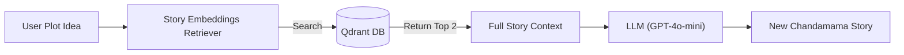

# Chandamama Studio 🌙

An AI-powered application to explore, search, and "weave" new stories inspired by the legendary *Chandamama* magazine archive (1947-2012).

## Features
- **📖 Story Weaver**: Generate *new* stories in strict Chandamama style, grounded in actual archive content (RAG).
- **🏛️ The Council**: Evaluate story quality across 5 top LLMs (GPT-4o, Qwen 2.5, Llama 3.1, etc.).
- **🪕 Poem Weaver**: Compose new Telugu poems and songs based on archive themes.
- **🔍 RAG Search**: Semantically search full stories using `Alibaba-NLP/gte-multilingual-base` (8k context).
- **📊 Analytics**: View stats on 10,000+ stories (Authors, Characters, Locations).

## 🧠 System Architecture (RAG Flow)



## Setup & Installation

### 1. Requirements
- Python 3.9+
- OpenAI API Key

### 2. Install Dependencies
```bash
pip install -r requirements.txt
```
*(Ensure `qdrant-client`, `sentence-transformers`, `streamlit`, `openai`, `python-dotenv` are installed)*

### 3. Environment Variables
1. Copy `.env.template` to `.env`.
2. Add your `OPENAI_API_KEY`.
```bash
cp .env.template .env
```

## How to Run

### Run the App
```bash
streamlit run app.py
```

### Modes
- **Online Mode (RAG Enabled)**: Requires `qdrant_db/` folder to exist.
- **Offline Mode**: If `qdrant_db/` is missing, the app runs in "Creative Mode" (Uses AI knowledge only, no archive context).

## Collaboration (For Teammates)

**IMPORTANT**: The database (`qdrant_db`) is too large for Git. To set up the full project:

1. **Pull the Code**: Clone this repository.
2. **Download Data**: Ensure you have the `chunks/` folder or source JSONs.
3. **Rebuild the Database**:
   Run this single command to generate the database locally (takes ~10 mins):
   ```bash
   python rebuild_db.py
   ```
4. **Run App**: 
   ```bash
   streamlit run app.py
   ```

## Project Structure
- `app.py`: Main Streamlit application.
- `src/`: Core logic (`story_gen.py`, `rag.py`).
- `utils/`: Data processing scripts (`aggregate_stats.py`).
- `stats/`: Aggregated JSON statistics (`global_stats.json`, `poem_stats.json`).
- `qdrant_db/`: Vector Database (Local).
- `chunks/`: Processed text chunks for indexing.

## Research Notes
This project demonstrates **Retrieval Augmented Generation (RAG)** applied to low-resource languages (Telugu) and specific cultural archives. See `report.md` for full research journey.
h