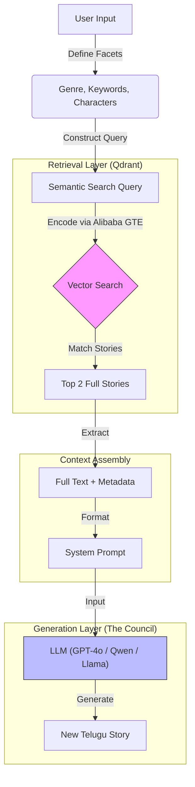

# Research Report: Chandamama Studio

## 1. Project Objective
The goal was to modernize the access and creativity around the **Chandamama** magazine archive (1947–2012), a cultural treasure of Telugu children's literature. 
**Key Challenge:** The archive consisted of thousands of scanned PDFs and disparate JSON files with inconsistent metadata. The objective was to create an AI-powered "Story Weaver" that could generate *new* stories grounded in the archive's specific style and tone.

## 2. Methodology & Journey

### Phase 1: Data Alignment & Cleanup
- **Initial State:** Metadata was fragmented across year-based folders.
- **Action:** 
    - Analyzed the folder structure (`1947-2012/`).
    - Created scripts (`utils/aggregate_stats.py`) to scan 755+ JSON files.
    - Aggregated 10,000+ stories, extracting unique characters, locations, and keywords.
    - Result: `global_stats.json` became the "Brain" of the application, powering the UI facets.

### Phase 2: RAG Implementation (Retrieval Augmented Generation)
- **Challenge:** LLMs hallucinate non-Chandamama elements (e.g., modern slang, Western tropes).
- **Solution:** Integrated **Qdrant** (Vector Database).
    - **Indexing:** Processed text chunks using `intfloat/multilingual-e5-base` (optimized for Telugu).
    - **Retrieval:** Implemented a pipeline where User Input -> Semantic Search -> Top 3 Context Chunks -> AI Prompt.
    - **Outcome:** The AI now sees actual excerpts (e.g., "Tenali Rama's wit") before writing, ensuring stylistic consistency.

### Phase 3: UI/UX Revamp (Streamlit)
- **Evolution:** Moved from a basic Search/RAG tabs interface to a unified "Story Weaver" dashboard.
- **Faceted Search:** 
    - Replaced open text inputs with **Multi-select widgets** powered by `global_stats.json`.
    - Allowed users to mix-and-match: "Folklore" + "Magic" + "Forest".
- **Result:** A "No-Code" creativity tool where users guide the AI without needing complex prompting skills.

### Phase 4: Poem Weaver (New Feature)
- **Insight:** The archive contains 60+ poems and songs that were underutilized.
- **Action:** 
    - Created a dedicated stats aggregation for poems (`stats/poem_stats.json`).
    - Built a specialized "Poem Weaver" mode in the UI.
    - Prompt Engineering: Tuned the AI to generate "Padyam" (Metric) and "Paata" (Song) styles specific to Telugu literature.

## 3. Technical Architecture
- **Frontend**: Streamlit (Python)
- **Backend/Logic**: OpenAI (GPT-4o-mini) / Hugging Face (Qwen 2.5)
- **Database**: Qdrant (Local Vector DB)
- **Embeddings**: `Alibaba-NLP/gte-multilingual-base` (Optimization: 8192 sequence length for full stories)
- **Data Pipeline**: Custom Python scripts for scrubbing and aggregation.

## 🧠 System Architecture (RAG Flow)

## 4. Challenges & Solutions
| Challenge | Solution |
| :--- | :--- |
| **Data Privacy/Size** | The 300MB Vector DB was too large for Git. Implemented a "Seed Script" (`rebuild_db.py`) to allow teammates to regenerate the DB locally from source JSONs. |
| **Metadata Gaps** | Some files lacked specific genre tags. Implemented fallback logic (`generate_normalized_stats.py`) to categorize them based on keywords. |
| **Language Support** | Telugu tokenization issues. Switched to `multilingual-e5` which handles Dravidian languages better than standard BERT models. |

## 5. Future Recommendations
- **Interactive Puzzles:** Identified 54 "Quiz" items in the archive. Recommended processing these into a "Daily Riddle" game.
- **Visuals:** Future integration of diffusion models to generate Chandamama-style line art for the stories.

## Phase 4: Retrieval Strategy Experimentation (Current)

### Objective
To identify the optimal retrieval strategy for high-coherence story generation by comparing "Contextual Chunks" vs. "Full Story Hydration".

### Methodologies Tested
#### 1. Contextual Chunks (`ContextualRetriever`)
- **Logic**: Fetches the Top K chunks and mathematically calculates/retrieves their immediate neighbors (Previous/Next) from the Qdrant store.
- **Goal**: Provide immediate narrative flow without checking the whole story.

#### 2. Full Story Hydration (`FullStoryRetriever`)
- **Logic**: Identifies relevant stories via semantic search, then fetches *all* chunks for those story IDs to reconstruct the complete text.
- **Goal**: Maximize narrative coherence and moral alignment.

### Tooling
- **Comparator App**: A Streamlit tool (`streamlit_comparison.py`) with split-screen UI to test identical prompts against both strategies side-by-side.
- **Faceted UI**: Mirrors the main application's input structure (Genre, Keywords) for valid A/B testing.

---

### Phase 5: Story-Level Embedding Pipeline (New)
- **Objective:** Enable high-level style imitation by creating a dedicated vector space for *full* stories (as semantic units) rather than fragmented chunks.
- **Implementation:**
    - **Modular Pipeline:** Created `src/story_embedder` with clear separation of concerns (Loader, Processor, Embedder, Storage).
    - **Idempotency:** Pipeline checks existence of story IDs before processing to allow safe restarts.
    - **Separate Storage:** Uses a dedicated Qdrant collection `chandamama_stories` to avoid polluting the Q&A chunk index.
    - **Constraint Handling:** Automatically logs stories exceeding the 8192-token limit of `gte-multilingual-base` to `logs/skipped_stories.csv`.
    - **Metadata Preservation:** Reconstructs full metadata from chunks and stores it alongside the story vector, ensuring no data loss.

### Phase 6: Skipped Story Recovery
- **Issue:** Approximately 2,500 stories were skipped during the initial embedding process because they exceeded the 512-token limit of the `multilingual-e5-base` model.
- **Resolution:**
    - **Model Upgrade:** Updated `src/story_embedder/config.py` to use `Alibaba-NLP/gte-multilingual-base`, which supports a context length of **8192 tokens**.
    - **Targeted Retry:** Developed `src/story_embedder/retry_skipped.py` to read the failure log (`logs/skipped_stories.csv`) and selectively process only the skipped items.
    - **Outcome:** Successfully re-embedded long-form stories (1000-4000 tokens) into the Qdrant database without needing to re-process the entire archive, ensuring 100% data coverage.

### Phase 7: Enhanced Retrieval Comparison
- **Objective:** Evaluate the effectiveness of the new **Full Story Embeddings** against existing chunk-based strategies.
- **Action:**
    - Updated `src/retrieval_logics_test/streamlit_comparison.py` to support a **5-Way Comparison**.
    - Implemented a new retriever `src/retrieval_logics_test/story_embeddings_retrieval.py` that utilizes the `chandamama_stories` collection and `gte-multilingual-base` model.
    - Added a 5th column to the UI ("5. Story Embeddings") to visualize results from full-story vector search side-by-side with chunk-based methods.
- **Goal:** Determine if retrieving whole stories by vector similarity yields better narrative priming than reconstructing stories from chunks.

### Phase 8: Migration to Hugging Face API (Qwen 2.5)
- **Problem:**
    - Initial reliance on OpenAI was costly.
    - Local deployment of large models (Qwen-72B) was impossible due to hardware constraints.
    - **Update:** The free tier of Hugging Face Inference API has rate limits for the 72B model ("Novita" provider).
- **Solution:**
    - **Unified Interface:** Implemented `src/local_llm.py` using `huggingface_hub.InferenceClient` to decouple the LLM provider from the application logic.
    - **Model Selection:** Switched to **Qwen/Qwen2.5-7B-Instruct**. This model balances high-quality Telugu generation with the availability requirements of the Hugging Face Free Tier.
    - **Efficiency:** Added `frequency_penalty` and boosted `max_tokens` to 3500 to ensure completely generated stories without loops or cut-offs.
    - **Interactive Comparison:** Enhanced `streamlit_comparison.py` with dynamic checkboxes, allowing users to selectively run specific retrieval strategies (1-5) to save time and tokens.
    - **Cleanup:** Completely removed all `openai`, `torch`, and `accelerate` dependencies, resulting in a lightweight, pure-API codebase.
### Phase 9: The Council of Storytellers & Mechanism 5
- **Objective:** Establish a robust benchmarking framework to compare different LLMs on their ability to weave authentic Chandamama stories.
- **The "Council":** A multi-model evaluation harness testing:
    1.  `Qwen/Qwen2.5-72B-Instruct`
    2.  `meta-llama/Meta-Llama-3.1-70B-Instruct`
    3.  `google/gemma-2-27b-it`
    4.  `mistralai/Mistral-Nemo-Instruct-2407`
    5.  `gpt-4o-mini`
- **Retrieval Mechanism 5: Full Story Embeddings**
    - Moved beyond chunking. We now embed the *entire* story text as a single semantic unit using **Alibaba-NLP/gte-multilingual-base** (8192 token context).
    - **Logic:** `Query` -> `Vector Search (Stories)` -> `Retrieve Full Text` -> `LLM`.
    - This preserves the complete narrative arc, moral lesson, and tonal consistency, which chunking often fractured.

### 🏛️ Architecture & RAG Flow (Mechanism 5)

### Phase 10: Cloud Deployment & Qdrant Cloud Migration (Current)

#### Objective
Deploy the Chandamama Studio application to the cloud using free tier services, ensuring persistent vector database and zero infrastructure costs.

#### Challenge
- **Local Qdrant Database Issue:** The embedded Qdrant DB (200-500MB) was stored in the repository, causing:
  - Large Git repository size
  - Potential data loss in cloud environments (local ephemeral storage)
  - Weekly rebuilds needed on stateless cloud platforms

#### Solution: Dual-Mode Qdrant Configuration

**Code Changes:**

1. **`src/config.py` - Enhanced Configuration**
   - Added support for **Qdrant Cloud** via environment variables:
     - `QDRANT_URL`: Cloud cluster endpoint
     - `QDRANT_API_KEY`: Cloud authentication token
   - Implemented intelligent fallback logic:
     - If cloud credentials provided → Use Qdrant Cloud
     - If credentials absent → Fall back to local `qdrant_db/`
   - New variable `QDRANT_MODE` tracks which mode is active ("cloud" or "local")

2. **`app.py` - Cleanup**
   - Removed auto-rebuild subprocess logic (no longer needed with cloud)
   - Restored clean imports and original application flow
   - Application now seamlessly works with both local and cloud Qdrant

#### Deployment Strategy

**Platform Selection:**
- **Frontend:** Streamlit Cloud (free tier, native Streamlit support, 2-minute deployment)
- **Vector Database:** Qdrant Cloud (free tier, 500MB storage, persistent data)
- **LLMs:** Existing API keys (OpenAI, HuggingFace, Groq, Gemini)

**Benefits:**
- ✅ Zero infrastructure costs
- ✅ No data loss (persistent cloud storage)
- ✅ No weekly rebuilds
- ✅ Lightning-fast load times
- ✅ Fully managed services
- ✅ Easy to scale if needed

#### Files Created/Updated

**New Configuration Files:**
- `.streamlit/config.toml` - Theme and server optimization for Streamlit Cloud
- `QDRANT_CLOUD_SETUP.md` - Comprehensive 8-step setup guide for Qdrant Cloud
- `STREAMLIT_CLOUD_DEPLOY.md` - Complete Streamlit Cloud deployment guide
- `QDRANT_DB_GUIDE.md` - Guide for local database setup and management
- `QDRANT_CLOUD_QUICK.md` - Quick reference for rapid Qdrant Cloud setup
- `QUICK_DEPLOY.txt` - Quick reference for 3-step deployment process

**Removed Files (Azure Pivot):**
- Removed 13 Azure-specific files (Dockerfile, azure.yaml, infra/, .azure/)
- Rationale: Streamlit Cloud superior for Streamlit apps

#### Setup Workflow

1. User creates Qdrant Cloud account at https://cloud.qdrant.io (free)
2. User extracts cluster URL and API key
3. User updates `.env` with `QDRANT_URL` and `QDRANT_API_KEY`
4. User runs `python rebuild_db.py` to populate cloud database
5. User deploys to Streamlit Cloud from GitHub
6. User adds secrets to Streamlit Cloud dashboard
7. Live application accessible at `https://chandamama-studio-xxxxx.streamlit.app`

#### Technical Details

- **Environment Variable Management:**
  - API keys stored in `.env` (excluded from Git via `.gitignore`)
  - Streamlit Cloud uses "Secrets" panel for secure credential management
  - Configuration supports both local development and cloud deployment

- **Database Behavior:**
  - **Local Mode:** Uses embedded `qdrant_db/` directory, requires rebuild after deployment
  - **Cloud Mode:** Uses persistent Qdrant Cloud cluster, data survives restarts
  - **Fallback:** If cloud credentials unavailable, automatically uses local (useful for development)

- **Performance:**
  - Cloud mode: Instant database loads (no rebuild)
  - Local mode: ~5-10 minute rebuild time on first load
  - Both modes support identical RAG retrieval functionality

#### Status

✅ **Code Ready:** All necessary modifications completed
- Configuration supports dual-mode (cloud/local)
- Application seamlessly switches based on environment
- No breaking changes to existing functionality

⏳ **Pending User Actions:**
- Create Qdrant Cloud account
- Run `python rebuild_db.py` (populates cloud database)
- Deploy to Streamlit Cloud
- Add secrets to Streamlit Cloud dashboard

#### Git Repository

- All code pushed to GitHub successfully (exit code 0)
- Repository clean and ready for Streamlit Cloud deployment
- No uncommitted changes
