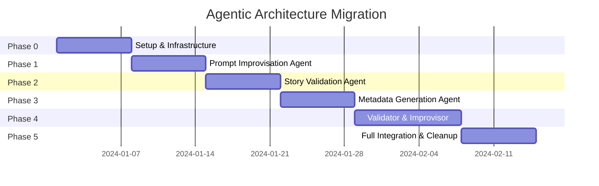

# Migration Plan

> **Safe, incremental transition from monolithic to agentic architecture**

---

## 1. Migration Philosophy

```
┌─────────────────────────────────────────────────────────────┐
│                    MIGRATION PRINCIPLES                     │
├─────────────────────────────────────────────────────────────┤
│ 1. ZERO-DOWNTIME: Never break existing functionality        │
│ 2. INCREMENTAL: One agent at a time                        │
│ 3. REVERSIBLE: Feature flags for instant rollback          │
│ 4. OBSERVABLE: Metrics at every stage                      │
│ 5. COEXISTENCE: Old and new run in parallel                │
└─────────────────────────────────────────────────────────────┘
```

---

## 2. Migration Phases



---

## 3. Phase 0: Infrastructure Setup (Week 1)

### Goals
- Set up feature flag system
- Create agent base class
- Add Supabase integration (optional)

### Deliverables

| Deliverable | Path | Description |
|-------------|------|-------------|
| Feature flags | `src/config.py` | Add FEATURE_FLAGS dict |
| Base agent | `src/agents/base_agent.py` | Abstract agent interface |
| Utils | `src/utils/telugu_utils.py` | Telugu validation helpers |

### Feature Flag Addition

```python
# src/config.py (additions)

FEATURE_FLAGS = {
    # Workflow 2 agents
    "use_prompt_improvisation": False,   # Phase 1
    "use_story_validation": False,       # Phase 4
    
    # Workflow 1 agents  
    "use_ingestion_validation": False,   # Phase 2
    "use_metadata_agent": False,         # Phase 3
    
    # Storage
    "use_supabase_storage": False,       # Optional
}
```

### Rollback Strategy
- All flags default to `False`
- Existing code paths unchanged
- Zero risk at this phase

---

## 4. Phase 1: Prompt Improvisation Agent (Week 2)

### Goals
- Deploy prompt enhancement without changing RAG or generation

### Integration Point

```python
# src/story_gen.py (modified)

def generate_story(facets: dict, context_text: str = "", ...):
    # NEW: Optional prompt improvisation
    if config.FEATURE_FLAGS.get("use_prompt_improvisation"):
        from src.agents.prompt_agent import PromptImprovAgent
        agent = PromptImprovAgent()
        improved = agent.run(facets.get("prompt_input", ""))
        facets["prompt_input"] = improved["telugu_prompt"]
    
    # EXISTING: Rest of the function unchanged
    ...
```

### Verification
- A/B test: 10% traffic uses new agent
- Compare story quality scores
- Monitor latency impact

### Rollback
```python
FEATURE_FLAGS["use_prompt_improvisation"] = False
# Immediate effect, no restart needed if using env vars
```

---

## 5. Phase 2: Story Validation Agent (Week 3)

### Goals
- Add validation for new story ingestion UI
- Does NOT affect existing generation workflow

### Integration Point

```python
# src/ingestion/ingest_handler.py (NEW)

def ingest_story(story_text: str, user_fields: dict) -> dict:
    # Step 1: Validation
    if config.FEATURE_FLAGS.get("use_ingestion_validation"):
        from src.agents.validation_agent import ValidationAgent
        validation = ValidationAgent().run(story_text, user_fields)
        
        if validation["status"] == "invalid":
            return {"success": False, "reason": validation["rejection_reason"]}
    
    # Step 2: Continue with existing pipeline
    ...
```

### Verification
- Unit tests for Telugu detection
- Integration tests with sample stories
- Monitor rejection rates

### Rollback
```python
FEATURE_FLAGS["use_ingestion_validation"] = False
```

---

## 6. Phase 3: Metadata Generation Agent (Week 4)

### Goals
- Auto-generate metadata for ingested stories
- Enhance existing stats generation

### Integration Point

```python
# src/ingestion/ingest_handler.py (addition)

def ingest_story(story_text: str, user_fields: dict) -> dict:
    # ... validation ...
    
    # Step 2: Metadata generation
    if config.FEATURE_FLAGS.get("use_metadata_agent"):
        from src.agents.metadata_agent import MetadataAgent
        metadata = MetadataAgent().run(story_text, user_fields)
    else:
        # Fallback: use user_fields directly
        metadata = {**user_fields, "text": story_text}
    
    # Step 3: Continue with embedding
    ...
```

### Verification
- Compare auto-generated metadata with manual
- Validate genre classification accuracy
- Check keyword extraction quality

### Rollback
```python
FEATURE_FLAGS["use_metadata_agent"] = False
```

---

## 7. Phase 4: Validator & Improvisor Agent (Week 5-6)

### Goals
- Add quality gating to story generation
- Enable regeneration loop

### Integration Point

```python
# src/story_gen.py (modified end section)

def generate_story(facets: dict, context_text: str = "", ...):
    # ... existing generation code ...
    
    # NEW: Optional validation
    if config.FEATURE_FLAGS.get("use_story_validation"):
        from src.agents.validator_agent import ValidatorAgent
        validator = ValidatorAgent()
        
        attempt = 1
        while attempt <= 3:
            validation = validator.evaluate(full_text, facets)
            
            if validation["status"] == "success":
                # Polish and return
                polished = validator.polish(full_text)
                yield polished
                return
            
            elif validation["status"] == "retry":
                # Regenerate with feedback
                facets["_feedback"] = validation["feedback"]
                full_text = _regenerate(facets, context_text)
                attempt += 1
        
        # Max attempts: return best
        yield validation["best_attempt"]
    else:
        yield full_text
```

### Verification
- Quality score distribution analysis
- Regeneration rate monitoring
- Latency impact measurement

### Rollback
```python
FEATURE_FLAGS["use_story_validation"] = False
```

---

## 8. Phase 5: Full Integration (Week 7)

### Goals
- Remove feature flags (make agents default)
- Clean up duplicate code paths
- Final documentation

### Tasks

1. **Enable all flags by default**
2. **Remove conditional branches** (only keep agent paths)
3. **Update tests** to use agent interfaces
4. **Archive legacy code** (don't delete immediately)

---

## 9. Rollback Matrix

| Phase | Agent | Rollback Flag | Recovery Time |
|-------|-------|---------------|---------------|
| 1 | Prompt Improvisation | `use_prompt_improvisation=False` | Instant |
| 2 | Story Validation | `use_ingestion_validation=False` | Instant |
| 3 | Metadata Generation | `use_metadata_agent=False` | Instant |
| 4 | Validator | `use_story_validation=False` | Instant |

### Emergency Rollback Procedure

```bash
# 1. Set environment variable
export USE_PROMPT_IMPROVISATION=false
export USE_STORY_VALIDATION=false
# etc.

# 2. Restart application
pkill -f streamlit && streamlit run app.py

# 3. Verify rollback
curl http://localhost:8501/health
```

---

## 10. Success Metrics

| Metric | Target | Measurement |
|--------|--------|-------------|
| Story quality score | +10% | A/B test comparison |
| LLM cost per story | -20% | Token usage tracking |
| Ingestion rejection rate | <5% valid stories | Validation logs |
| User satisfaction | No decrease | Survey/feedback |
| Latency | <30s | End-to-end timing |

---

## 11. Risk Mitigation

| Risk | Mitigation |
|------|------------|
| Agent introduces bugs | Feature flags for instant rollback |
| Higher latency | Parallel processing, caching |
| LLM cost increase | Two-step validation, smart caching |
| Breaking existing flows | Only add, never remove existing code |
| User complaints | Shadow testing before full rollout |

---

## 12. Testing Strategy

### Unit Tests
- Each agent has isolated unit tests
- Mock LLM calls for deterministic testing

### Integration Tests
- Workflow 1: Full ingestion pipeline
- Workflow 2: End-to-end story generation

### Shadow Testing
- Run new agents alongside old code
- Compare outputs without serving new results

### A/B Testing
- 10% traffic to new agents
- Measure quality and latency differences

---

## 13. Deployment Checklist

### Phase 0
- [ ] Feature flag system implemented
- [ ] Base agent class created
- [ ] Telugu utils module added
- [ ] All tests passing

### Phase 1
- [ ] Prompt agent deployed
- [ ] Flag enabled for 10% traffic
- [ ] Metrics dashboard set up
- [ ] Rollback tested

### Phase 2-4
- [ ] Agent deployed
- [ ] Integration tests passing
- [ ] Flag enabled progressively (10% → 50% → 100%)
- [ ] Metrics within targets

### Phase 5
- [ ] All flags enabled by default
- [ ] Legacy code archived
- [ ] Documentation updated
- [ ] Team trained on new architecture
