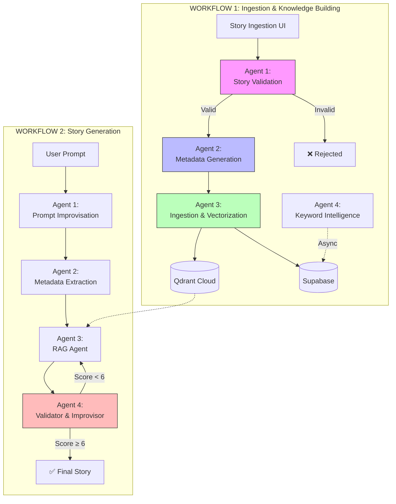
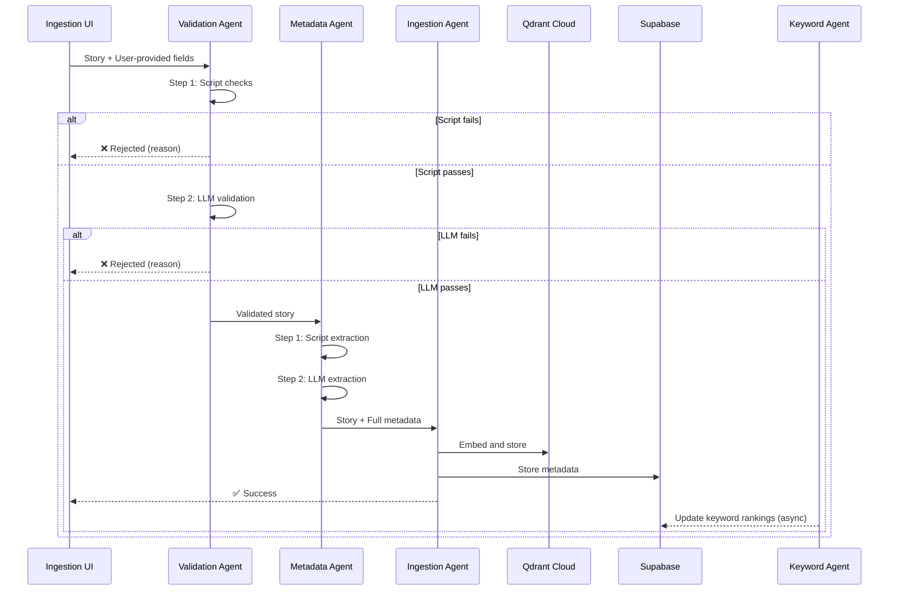
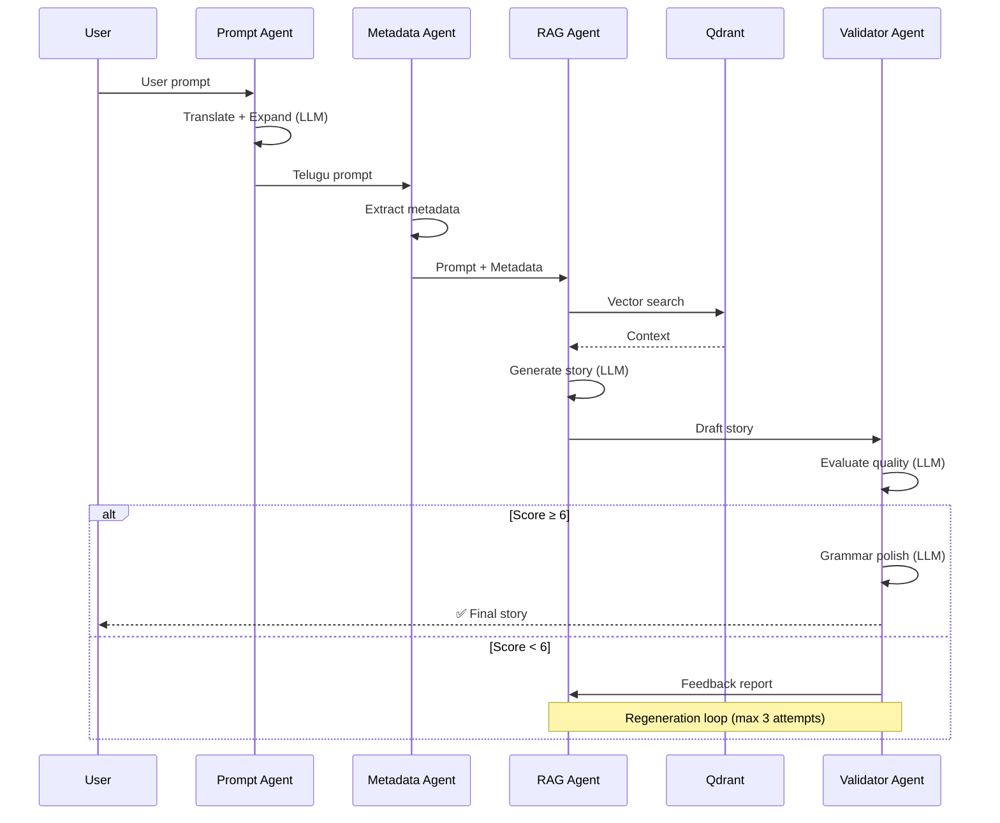

# Agentic Architecture Overview

> **Chandamama Studio: Multi-Agent System Design**

---

## 1. Vision

Transform the existing monolithic Telugu story generation system into a **modular multi-agent architecture** that:
- Maintains backward compatibility with all existing functionality
- Enables independent scaling and optimization of each component
- Introduces quality gating at every stage
- Optimizes LLM usage through intelligent two-step processing

---

## 2. System Diagram



---

## 3. Agent Summary

### Workflow 1: Ingestion & Knowledge Building

| # | Agent | Purpose | Primary Logic | LLM Usage |
|---|-------|---------|---------------|-----------|
| 1 | **Story Validation Agent** | Validate incoming stories | Script → LLM (two-step) | ✅ Conditional |
| 2 | **Metadata Generation Agent** | Extract/generate metadata | Script → LLM (two-step) | ✅ Conditional |
| 3 | **Ingestion & Vectorization Agent** | Store stories + embeddings | Script only | ❌ None |
| 4 | **Keyword Intelligence Agent** | Track keyword trends | Script only (async) | ❌ None |

### Workflow 2: Story Generation

| # | Agent | Purpose | Primary Logic | LLM Usage |
|---|-------|---------|---------------|-----------|
| 1 | **Prompt Improvisation Agent** | Enhance & translate prompts | LLM | ✅ Always |
| 2 | **Metadata Extraction Agent** | Extract metadata from prompt | REUSES Agent 2 from WF1 | ✅ Conditional |
| 3 | **RAG Agent** | Retrieve context + generate | Script + LLM | ✅ Always |
| 4 | **Validator & Improvisor Agent** | Quality gate + grammar | LLM | ✅ Always |

---

## 4. Two-Step Processing Pattern

All agents that support two-step processing follow this pattern:

```
┌─────────────────────────┐
│     STEP 1: SCRIPT      │
│  ─────────────────────  │
│  • Fast, cheap checks   │
│  • No API costs         │
│  • Fail early           │
└───────────┬─────────────┘
            │ Pass?
            ▼
┌─────────────────────────┐
│     STEP 2: LLM         │
│  ─────────────────────  │
│  • Deep understanding   │
│  • Semantic analysis    │
│  • Only if needed       │
└─────────────────────────┘
```

**Cost Optimization:**
- 60-80% of invalid inputs caught by STEP 1
- LLM costs reduced proportionally
- Faster response times for obvious cases

---

## 5. Data Flow

### Workflow 1: Ingestion



### Workflow 2: Generation



---

## 6. Storage Architecture

### Dual Storage Model
```
┌────────────────────────────────────────────────────────────────────┐
│                      STORAGE ARCHITECTURE                          │
├────────────────────────────────────────────────────────────────────┤
│                                                                    │
│  ┌─────────────────┐         ┌─────────────────┐                  │
│  │   Qdrant Cloud  │         │    Supabase     │                  │
│  │  ─────────────  │         │  ─────────────  │                  │
│  │  PRIMARY STORE  │         │  BACKUP STORE   │                  │
│  │  • Vectors      │         │  • Raw stories  │                  │
│  │  • Metadata     │         │  • Weekly sync  │                  │
│  │  • Full text    │         │  • Disaster     │                  │
│  │  • Live queries │         │    recovery     │                  │
│  └────────┬────────┘         └────────┬────────┘                  │
│           │                           │                            │
│           └───────────┬───────────────┘                            │
│                       │                                            │
│            ┌──────────▼──────────┐                                │
│            │    Local Disk       │                                │
│            │  (Weekly Snapshot)  │                                │
│            └─────────────────────┘                                │
│                                                                    │
└────────────────────────────────────────────────────────────────────┘
```

### Storage Responsibilities

| Storage | Purpose | Data | Sync Frequency |
|---------|---------|------|----------------|
| **Qdrant Cloud** | Primary: RAG queries, vector search | Vectors + metadata + full text | Real-time |
| **Supabase** | Backup: Disaster recovery, offline access | Raw story JSON | Weekly |
| **Local Disk** | Snapshot: Intermediate backup | Story exports | Weekly |

### Data Flow

```
Story Ingestion → Qdrant (immediate) 
                        ↓
              Weekly Backup Job
                        ↓
              Export to Local Disk
                        ↓
              Sync to Supabase
```

**Rationale:**
- Qdrant is the **single source of truth** for live operations
- Supabase provides **durability** without impacting query performance
- Weekly backup is sufficient (archive content doesn't change frequently)
- Local disk snapshot enables offline development/testing

---

## 7. Agent Communication

### Inter-Agent Protocol

All agents communicate via **structured JSON messages**:

```json
{
    "agent_id": "validation_agent",
    "status": "success" | "failure" | "pass_through",
    "payload": {
        // Agent-specific data
    },
    "metadata": {
        "timestamp": "ISO-8601",
        "processing_time_ms": 123,
        "step_completed": "script" | "llm" | "both"
    },
    "error": null | {
        "code": "VALIDATION_FAILED",
        "message": "Telugu content < 50%",
        "recoverable": false
    }
}
```

### State Management

| Workflow | State Location | Persistence |
|----------|----------------|-------------|
| Ingestion | Supabase (ingestion queue table) | Persistent |
| Generation | In-memory (RAM) | Ephemeral |

---

## 8. Mapping to Existing Code

### Reused Unchanged

| Existing Code | Used By Agent |
|---------------|---------------|
| `src/config.py` | All agents (shared config) |
| `src/retrieval/vector_search.py` | RAG Agent |
| `src/story_embedder/embedder.py` | Ingestion Agent |
| `src/story_embedder/storage.py` | Ingestion Agent |
| `src/story_gen.py` (prompt templates) | RAG Agent |

### Wrapped/Extended

| Existing Code | Wrapped By |
|---------------|------------|
| `src/generate_chunks.py` | Ingestion Agent (chunking logic) |
| `src/story_embedder/story_processor.py` | Ingestion Agent |
| `src/local_llm_multi.py` | All LLM-using agents |

### New Components

| New Component | Location |
|---------------|----------|
| `src/agents/base_agent.py` | Base class for all agents |
| `src/agents/validation_agent.py` | Story Validation Agent |
| `src/agents/metadata_agent.py` | Metadata Generation Agent |
| `src/agents/ingestion_agent.py` | Ingestion & Vectorization Agent |
| `src/agents/prompt_agent.py` | Prompt Improvisation Agent |
| `src/agents/rag_agent.py` | RAG Agent |
| `src/agents/validator_agent.py` | Validator & Improvisor Agent |
| `src/agents/keyword_agent.py` | Keyword Intelligence Agent |
| `src/utils/telugu_utils.py` | Script-based Telugu checks |

---

## 9. Feature Flags

All new agents will be gated behind feature flags for safe rollout:

```python
# src/config.py (additions)

FEATURE_FLAGS = {
    "use_validation_agent": False,    # WF1: Enable validation
    "use_metadata_agent": False,      # WF1: Enable auto-metadata
    "use_prompt_improvisation": False, # WF2: Enable prompt enhancement
    "use_story_validation": False,    # WF2: Enable output validation
    "use_supabase_storage": False,    # Use Supabase for metadata
}
```

**Rollout Strategy:**
1. Deploy agents with all flags `False` (no behavior change)
2. Enable one agent at a time in staging
3. Monitor metrics before enabling in production
4. Quick rollback by toggling flag

---

## 10. Success Metrics

| Metric | Target | Current |
|--------|--------|---------|
| Story validation rejection rate | < 5% (for valid stories) | N/A |
| LLM calls saved (two-step) | > 60% | 0% |
| Generated story quality score | > 7/10 | N/A |
| Regeneration rate | < 20% | N/A |
| End-to-end generation latency | < 30s | ~25s |

---

## Documents

- [Workflow 1: Ingestion](workflow_1_ingestion.md)
- [Workflow 2: Generation](workflow_2_generation.md)
- [Understanding Confirmation](understanding_confirmation.md)
- [Agent Specifications](../agents/)
