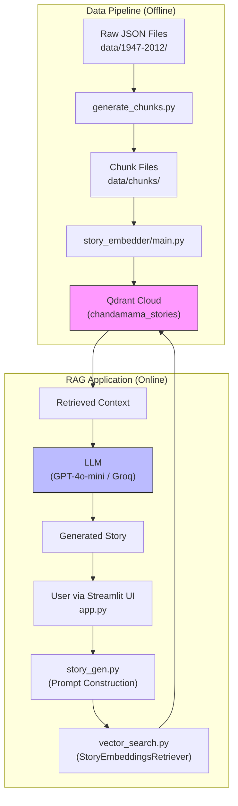

# Understanding Confirmation: Chandamama Studio Repository

> **Before proposing the agentic architecture, this document confirms my complete understanding of the existing system.**

---

## 1. Project Overview

**Chandamama Studio** is an AI-powered application for exploring, searching, and generating NEW stories inspired by classic Telugu children's literature from the Chandamama magazine archive (1947-2012).

### Key Capabilities (Currently Working)
- **📖 Story Generator**: RAG-based story generation grounded in archive content
- **📚 Serial Generator**: Multi-chapter serial stories with cliffhangers
- **🪕 Poem Generator**: Telugu poems and songs based on archive themes
- **🔍 RAG Search**: Semantic search across 10,000+ stories
- **🧩 Puzzle Generator**: Story-inspired crossword puzzles
- **📊 Analytics**: Statistics on authors, characters, locations

---

## 2. Current Architecture (Monolithic, Script-Driven)



---

## 3. Data Pipeline (Ingestion Flow)

### 3.1 Source Data
| Location | Contents |
|----------|----------|
| `data/1947-2012/` | 755 source JSON files (one per magazine issue) |
| Format | `చందమామ_YYYY_MM.json` containing `stories[]` array |

### 3.2 Chunking (Step 1)
**Script:** `src/generate_chunks.py`

**Process:**
1. Reads source JSON files
2. Splits stories into chunks (300-500 tokens target)
3. Outputs to `data/chunks/YYYY/చందమామ_YYYY_MM_chunks.json`

**Chunk Schema (per chunk):**
```json
{
    "story_id": "unique_story_identifier",
    "chunk_id": "story_id_01",
    "chunk_index": 1,
    "year": 1957,
    "month": 2,
    "source_path": "1957/చందమామ_1957_02.json",
    "title": "Story Title",
    "author": "Author Name",
    "normalized_genre_code": "FOLKLORE",
    "content_type": "STORY",
    "keywords": ["keyword1", "keyword2"],
    "language": "Telugu",
    "text": "Chunk content..."
}
```

### 3.3 Story Reconstruction & Embedding (Step 2)
**Module:** `src/story_embedder/`

| File | Responsibility |
|------|----------------|
| `data_loader.py` | Scans and loads `*_chunks.json` files |
| `story_processor.py` | Reconstructs full stories from chunks |
| `embedder.py` | Generates embeddings using `Alibaba-NLP/gte-multilingual-base` |
| `storage.py` | Upserts to Qdrant Cloud |
| `main.py` | Orchestrates the pipeline |

**Embedding Composition:**
```
Title: {title}
Author: {author}
Keywords: {keywords}

{full_story_text}
```

### 3.4 Storage
| Storage | Collection | Contents |
|---------|------------|----------|
| **Qdrant Cloud** | `chandamama_stories` | 10,181 full story embeddings + metadata |
| **Qdrant Cloud** | `chandamama_chunks` | ~26K chunk embeddings (legacy, not actively used) |

> [!NOTE]
> **NO SUPABASE exists in the current implementation.** The user's requirement mentions Supabase, but the existing system stores ALL data in Qdrant Cloud (vectors + metadata payloads).

---

## 4. Vector DB Schema (Qdrant Payload)

Each point in `chandamama_stories` collection contains:

```json
{
    "story_id": "string",
    "title": "string",
    "author": "string",
    "year": "int",
    "month": "int",
    "source_path": "string",
    "normalized_genre_code": "string",
    "content_type": "string",  
    "keywords": ["array", "of", "strings"],
    "language": "string",
    "text": "FULL story text for RAG retrieval"
}
```

**Genre Codes (normalized_genre_code):**
- `FOLKLORE`, `MYTHOLOGY`, `SCIENCE`, `COMEDY`, `ADVENTURE`, `MYSTERY`, `MORAL_STORY`, `CHILDREN_STORY`, `PUZZLE`, etc.

**Content Types:**
- `STORY`, `POEM`, `SONG`, `SERIAL`, `PUZZLE`, `QUIZ`

---

## 5. Retrieval System

**Class:** `StoryEmbeddingsRetriever` in `src/retrieval/vector_search.py`

**Flow:**
1. User query → Embed using `Alibaba-NLP/gte-multilingual-base`
2. Vector search in `chandamama_stories` collection
3. Return Top K (default: 3) full stories with metadata

**Key Method:**
```python
def retrieve(self, query: str) -> str:
    # Returns formatted string with story headers + full text
```

---

## 6. Story Generation System

**Module:** `src/story_gen.py`

**Input (Facets):**
```python
{
    "genre": "Folklore",
    "keywords": ["మాయ", "అడవి"],
    "characters": ["రాజు", "మంత్రి"],
    "locations": ["అడవి", "నది"],
    "content_type": "SINGLE" | "SERIAL",
    "num_chapters": 3,
    "prompt_input": "User's custom instructions",
    "tone": "traditional" | "modern" | "mythological"
}
```

**Process:**
1. Construct query string from facets
2. Retrieve context via `StoryEmbeddingsRetriever`
3. Build prompt with:
   - Genre-specific guidelines
   - Tone instructions
   - Anti-repetition rules
   - Keyword integration logic
   - Retrieved context
4. Call LLM (Groq/OpenAI) with streaming
5. Return generated story

**LLM Configuration:**
- Model: `openai/gpt-oss-120b` (via Groq)
- Temperature: 0.7
- Max Tokens: 3000

---

## 7. Configuration System

**File:** `src/config.py`

| Variable | Value | Purpose |
|----------|-------|---------|
| `QDRANT_URL` | ENV | Cloud endpoint |
| `QDRANT_API_KEY` | ENV | Cloud auth |
| `QDRANT_MODE` | `"cloud"` or `"local"` | Auto-detected |
| `STORY_COLLECTION_NAME` | `"chandamama_stories"` | Vector collection |
| `STORY_EMBEDDING_MODEL_NAME` | `"Alibaba-NLP/gte-multilingual-base"` | 8192 token limit |
| `LLM_MODEL_ID` | `"openai/gpt-oss-120b"` | Via Groq |

---

## 8. Statistics & Facets

**Files:**
- `data/stats/global_stats.json` (1MB) - Aggregated stats for faceted UI
- `data/stats/poem_stats.json` - Poem-specific stats
- `data/stats/normalized_stats.json` - Normalized genre mappings

**Stats Structure:**
```json
{
    "total_stories": 10212,
    "authors": {"Author Name": count, ...},
    "keywords": [...],
    "characters": [...],
    "locations": [...],
    "genres": [...]
}
```

---

## 9. Current Validation (None Exists)

> [!WARNING]
> **The current system has NO story validation agent.** Stories are ingested directly without:
> - Telugu Unicode verification
> - Content quality checks
> - LLM-based meaningfulness validation
> - Minimum length enforcement

---

## 10. Key Files & Their Roles

| File | Role |
|------|------|
| `app.py` | Streamlit UI entry point |
| `src/story_gen.py` | Story/poem generation with prompt templates |
| `src/retrieval/vector_search.py` | RAG retrieval via Qdrant |
| `src/config.py` | Centralized configuration |
| `src/generate_chunks.py` | Offline chunking of source data |
| `src/story_embedder/` | Offline embedding pipeline |
| `rebuild_db.py` | Orchestrates full DB rebuild |

---

## 11. Technologies Used

| Category | Technology |
|----------|------------|
| **Frontend** | Streamlit |
| **Vector DB** | Qdrant Cloud |
| **Embedding Model** | `Alibaba-NLP/gte-multilingual-base` (8192 tokens) |
| **LLM** | Groq API (`openai/gpt-oss-120b`) + OpenAI fallback |
| **Language** | Python 3.9+ |

---

## 12. What Does NOT Exist Currently

| Requirement | Current State |
|-------------|---------------|
| **Story Validation Agent** | ❌ Not implemented |
| **Metadata Auto-Generation** | ❌ Metadata comes from source JSONs |
| **Supabase Integration** | ❌ Only Qdrant used |
| **Prompt Improvisation** | ❌ Direct user input to RAG |
| **Generated Story Validation** | ❌ No quality scoring/gating |
| **Keyword Ranking/Intelligence** | ❌ Static stats only |
| **Two-Step Validation** | ❌ No script + LLM pipeline |

---

## 13. Confirmation

I have thoroughly analyzed the repository and understand:

✅ The complete data flow from source JSONs → chunks → embeddings → Qdrant  
✅ The RAG pipeline: facets → query → vector search → context → LLM → story  
✅ The metadata schema stored in Qdrant payloads  
✅ The prompt engineering approach in `story_gen.py`  
✅ The configuration and environment variable management  
✅ What currently exists vs. what needs to be added for the agentic architecture  

> [!IMPORTANT]
> **Key Observation:** The user mentioned Supabase in requirements, but the current system uses ONLY Qdrant Cloud. The agentic architecture will need to either:
> 1. Introduce Supabase for relational metadata (recommended for structured queries), OR
> 2. Document that Qdrant payloads serve as the metadata store (current approach)
>
> I will proceed with Option 1 (introduce Supabase) as per the user's original requirements.

---

**Ready to proceed with architecture documentation.**
