# Workflow 1: Ingestion & Knowledge Building

> **Complete pipeline for validating, processing, and storing new Telugu stories**

---

## 1. Overview

```mermaid
graph LR
    A["📝 UI Input"] --> B["🔍 Agent 1<br>Validation"]
    B --> C["📊 Agent 2<br>Metadata"]
    C --> D["💾 Agent 3<br>Ingestion"]
    D --> E["☁️ Storage"]
    F["📈 Agent 4<br>Keywords"] -.->|Async| E
    
    style B fill:#f9f
    style C fill:#bbf
    style D fill:#bfb
```



---

## 2. Trigger

- **Source**: Ingestion UI (new feature, not yet built)
- **Input**: Story text + user-provided fields
- **User-Provided Fields** (cannot be auto-extracted):
  - `author` (if known)
  - `source_reference` (original publication info)
  - `content_type` (STORY, POEM, SERIAL, etc.)

---

## 3. Step-by-Step Flow

### Step 1: Story Validation Agent

**Purpose**: Ensure only meaningful, valid Telugu content enters the system.

#### Input
```json
{
    "story_text": "Full story content...",
    "user_fields": {
        "author": "Optional author name",
        "source_reference": "Chandamama 1975-03",
        "content_type": "STORY"
    }
}
```

#### Processing

**STEP 1 (Script-Based) - Cheap Checks:**
| Check | Logic | Fail Action |
|-------|-------|-------------|
| Telugu Unicode Presence | `re.search(r'[\u0C00-\u0C7F]', text)` | Reject: "Not Telugu content" |
| Minimum Length | `len(text) >= 100` characters | Reject: "Story too short" |
| Empty/Whitespace Only | `text.strip() != ""` | Reject: "Empty content" |
| Telugu Ratio | Telugu chars / total chars ≥ 50% | Reject: "Insufficient Telugu" |
| Malformed Unicode | Check for invalid sequences | Reject: "Malformed text" |

**STEP 2 (LLM-Based) - Deep Validation (only if Step 1 passes):**
| Check | LLM Prompt Focus |
|-------|------------------|
| Is it a story? | "Is this coherent narrative content?" |
| Is it meaningful? | "Does this have plot/purpose?" |
| Is it appropriate? | "Is content suitable for children's literature?" |
| Is it worth storing? | "Would this add value to archive?" |

#### Output
```json
{
    "status": "valid" | "invalid",
    "validation_step": "script" | "llm",
    "rejection_reason": null | "Reason string",
    "validated_story": "Story text (passthrough)",
    "user_fields": { /* passthrough */ }
}
```

---

### Step 2: Metadata Generation Agent

**Purpose**: Generate complete metadata as per Qdrant/Supabase schema.

#### Input
```json
{
    "story_text": "Validated story content...",
    "user_fields": {
        "author": "Known author",
        "source_reference": "Chandamama 1975-03",
        "content_type": "STORY"
    }
}
```

#### Processing

**STEP 1 (Script-Based) - Extractable Fields:**
| Field | Extraction Method |
|-------|-------------------|
| `word_count` | `len(text.split())` |
| `char_count` | `len(text)` |
| `sentence_count` | Count `.?!` endings |
| `paragraph_count` | Count `\n\n` splits |
| `telugu_ratio` | Telugu chars / total |
| `year` | Parse from `source_reference` |
| `month` | Parse from `source_reference` |
| `story_id` | Generate UUID or hash |
| `language` | "Telugu" (validated in Step 1) |

**STEP 2 (LLM-Based) - Semantic Fields:**
| Field | LLM Task |
|-------|----------|
| `title` | Extract/generate title |
| `keywords` | Extract 5-10 keywords |
| `normalized_genre_code` | Classify genre |
| `theme` | Identify primary theme |
| `moral` | Extract moral (if present) |
| `characters` | Extract character names |
| `locations` | Extract location names |
| `summary` | Generate 2-3 sentence summary |

#### Output (Complete Metadata Object)
```json
{
    "story_id": "uuid-v4",
    "title": "కథ పేరు",
    "author": "రచయిత పేరు",
    "year": 1975,
    "month": 3,
    "source_reference": "Chandamama 1975-03",
    "normalized_genre_code": "FOLKLORE",
    "content_type": "STORY",
    "keywords": ["మాయ", "అడవి", "రాజు"],
    "characters": ["రామయ్య", "లక్ష్మి"],
    "locations": ["అడవి", "గ్రామం"],
    "theme": "ధర్మం",
    "moral": "నిజాయితీ గెలుస్తుంది",
    "summary": "రామయ్య అడవిలో...",
    "language": "Telugu",
    "word_count": 450,
    "char_count": 2500,
    "text": "Full story content..."
}
```

---

### Step 3: Ingestion & Vectorization Agent

**Purpose**: Store story + embeddings in Qdrant and metadata in Supabase.

#### Input
Complete metadata object from Step 2.

#### Processing (Script-Only, No LLM)

1. **Generate Embedding Text**:
```python
embedding_text = f"""Title: {metadata['title']}
Author: {metadata['author']}
Keywords: {', '.join(metadata['keywords'])}

{metadata['text']}"""
```

2. **Create Embedding**:
```python
from sentence_transformers import SentenceTransformer
model = SentenceTransformer("Alibaba-NLP/gte-multilingual-base")
embedding = model.encode(embedding_text, normalize_embeddings=True)
```

3. **Store in Qdrant**:
```python
qdrant_client.upsert(
    collection_name="chandamama_stories",
    points=[{
        "id": uuid5(DNS, story_id),
        "vector": embedding,
        "payload": {
            "story_id": story_id,
            "title": title,
            "text": text  # For RAG retrieval
        }
    }]
)
```

4. **Store in Supabase**:
```python
supabase.table("stories").insert({
    "story_id": story_id,
    "title": title,
    "author": author,
    # ... all metadata fields except embedding
}).execute()
```

#### Output
```json
{
    "status": "success",
    "story_id": "uuid-v4",
    "qdrant_point_id": "uuid-v5",
    "supabase_row_id": 12345
}
```

---

### Step 4: Keyword Intelligence Agent (Async)

**Purpose**: Track keyword frequency and update rankings for faceted search.

#### Trigger
- Runs asynchronously after Step 3 completes
- Does NOT block the ingestion workflow

#### Processing (Script-Only)

1. **Extract Keywords** from newly ingested story
2. **Update Frequency Table**:
```sql
INSERT INTO keyword_rankings (keyword, count)
VALUES ('మాయ', 1)
ON CONFLICT (keyword) 
DO UPDATE SET count = keyword_rankings.count + 1;
```

3. **Recalculate Percentile Rankings**:
```sql
UPDATE keyword_rankings 
SET percentile = PERCENT_RANK() OVER (ORDER BY count);
```

4. **Update Cached Stats** (optional):
```python
# Regenerate global_stats.json periodically
```

#### Output
No direct output (fire-and-forget async operation).

---

## 4. Data Storage Summary

| Data | Storage | Purpose | Sync |
|------|---------|---------|------|
| Embeddings + Metadata | **Qdrant Cloud** | Vector search, RAG (primary) | Real-time |
| Full stories (backup) | **Supabase** | Disaster recovery | Weekly |
| Local snapshot | **Disk** | Intermediate backup | Weekly |

**Weekly Backup Process:**
```
1. Export stories from Qdrant payloads → JSON files
2. Store JSON files to local disk (data/backups/)
3. Sync to Supabase stories table
```

> [!NOTE]
> Supabase is NOT queried during live operations. It serves only as a durable backup for disaster recovery.

---

## 5. Mapping to Existing Code

| Workflow Step | Existing Code | Reuse Strategy |
|---------------|---------------|----------------|
| Chunking (not needed for single stories) | `generate_chunks.py` | Reference for token counting |
| Embedding | `story_embedder/embedder.py` | Wrap with agent interface |
| Qdrant upsert | `story_embedder/storage.py` | Wrap with agent interface |
| Stats update | `utils/aggregate_stats.py` | Reference for stats schema |

---

## 6. Error Handling

| Error | Handling |
|-------|----------|
| Validation failure | Return rejection to UI, log reason |
| LLM timeout | Retry 3x, then reject with "Processing unavailable" |
| Qdrant failure | Retry 3x, then queue for later processing |
| Supabase failure | Continue (non-critical), log for manual fix |

---

## 7. Cost Considerations

| Stage | LLM Calls | Optimization |
|-------|-----------|--------------|
| Validation Step 1 | 0 | Script catches 60-80% of invalid inputs |
| Validation Step 2 | 1 | Only called if script passes |
| Metadata Step 1 | 0 | Script extracts simple fields |
| Metadata Step 2 | 1 | Extracts 8+ fields in single call |
| Ingestion | 0 | Pure script/API |
| Keyword Agent | 0 | Pure SQL |

**Total LLM Calls per Ingestion**: 2 (maximum, often 0-1)
