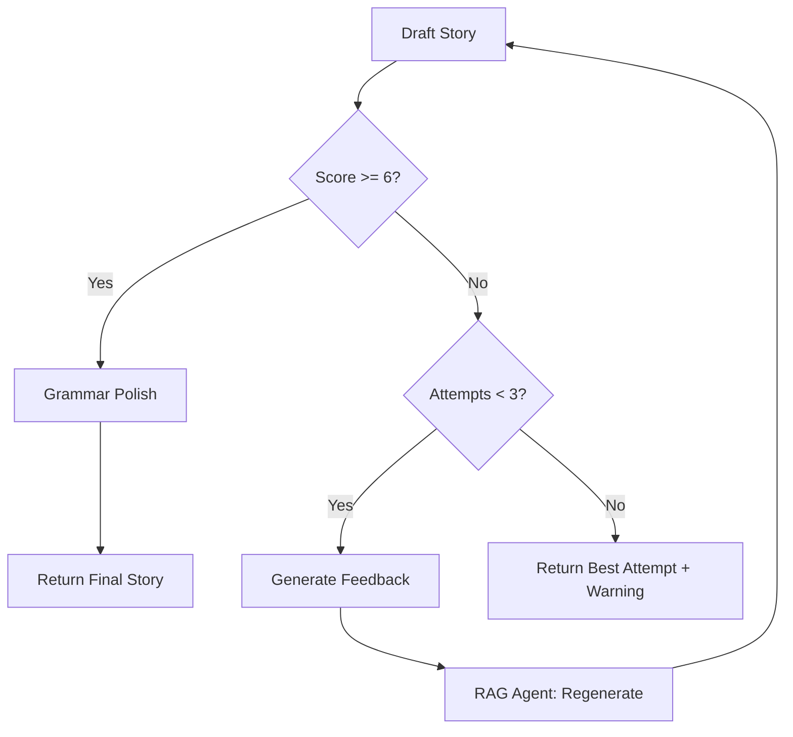

# Workflow 2: Story Generation

> **Complete RAG pipeline from user prompt to quality-validated Telugu story**

---

## 1. Overview

```mermaid
graph LR
    A["💭 User Prompt"] --> B["✨ Agent 1<br>Improvisation"]
    B --> C["📊 Agent 2<br>Metadata"]
    C --> D["🔍 Agent 3<br>RAG"]
    D --> E["✅ Agent 4<br>Validation"]
    E -->|Pass| F["📖 Final Story"]
    E -->|Fail| D
    
    style B fill:#f9f
    style D fill:#bbf
    style E fill:#fbb
```



---

## 2. Trigger

- **Source**: Story Generator UI (`app.py`)
- **Input**: User prompt (any language) + optional facets
- **Current Facets** (from existing UI):
  - `genre` - Story genre selection
  - `keywords` - Selected keywords
  - `characters` - Character names
  - `locations` - Setting locations
  - `tone` - Traditional/Modern/Mythological
  - `content_type` - SINGLE or SERIAL
  - `num_chapters` - For serials

---

## 3. Step-by-Step Flow

### Step 1: Prompt Improvisation & Telugu Optimization Agent

**Purpose**: Transform any user input into an optimal Telugu prompt for RAG.

#### Input
```json
{
    "user_prompt": "Write a story about a king who learns humility",
    "language_detected": "English",
    "facets": {
        "genre": "Moral Story",
        "keywords": ["రాజు", "వినయం"],
        "characters": [],
        "locations": []
    }
}
```

#### Processing (LLM Required)

**Tasks:**
1. **Language Detection & Translation**
   - Detect input language
   - Translate to Telugu if not already Telugu
   - Preserve user intent EXACTLY

2. **Prompt Expansion**
   - Expand vague prompts ("a nice story" → specific elements)
   - Add contextual details consistent with Chandamama style
   - DO NOT change the user's core request

3. **Format Optimization**
   - Structure for optimal RAG retrieval
   - Include all facets naturally

**LLM Prompt Template:**
```
You are a Telugu story prompt optimizer for the Chandamama archive.

USER INPUT: {user_prompt}
SELECTED FACETS: {facets}

TASKS:
1. If not in Telugu, translate to Telugu
2. Expand the prompt to be specific and rich
3. Preserve the user's original intent EXACTLY
4. Make it suitable for semantic search against Telugu story archives

OUTPUT only the optimized Telugu prompt. Nothing else.
```

#### Output
```json
{
    "original_prompt": "Write a story about a king who learns humility",
    "telugu_prompt": "అహంకారి రాజు వినయం నేర్చుకున్న కథ. రాజు తన గర్వం వల్ల రాజ్యాన్ని కోల్పోయి, సామాన్య ప్రజల మధ్య జీవించి వినయం యొక్క విలువ తెలుసుకుంటాడు.",
    "facets_integrated": ["రాజు", "వినయం", "గర్వం", "transformation"],
    "expansion_applied": true
}
```

---

### Step 2: Metadata Extraction Agent (REUSES WF1 Agent 2)

**Purpose**: Extract metadata from the PROMPT (not a story) for enhanced RAG search.

> [!IMPORTANT]
> This is the **SAME agent logic** as Workflow 1's Metadata Generation Agent, but applied to the prompt instead of a story. The extracted metadata is used **IN-MEMORY ONLY** to enhance vector search.

#### Input
```json
{
    "text": "అహంకారి రాజు వినయం నేర్చుకున్న కథ...",
    "source": "prompt",  // Signal to agent this is a prompt, not a story
    "user_facets": {
        "genre": "Moral Story",
        "keywords": ["రాజు", "వినయం"]
    }
}
```

#### Processing

**STEP 1 (Script-Based):**
- Merge user-provided facets
- No new extraction needed if facets are complete

**STEP 2 (LLM-Based) - Only if facets are sparse:**
- Extract implicit keywords
- Infer genre if not specified
- Identify themes

#### Output (In-Memory Only)
```json
{
    "keywords": ["రాజు", "వినయం", "గర్వం", "నైతిక కథ"],
    "normalized_genre_code": "MORAL_STORY",
    "theme": "character transformation",
    "characters_inferred": ["రాజు"],
    "locations_inferred": ["రాజ్యం", "గ్రామం"]
}
```

---

### Step 3: RAG Agent

**Purpose**: Retrieve relevant context and generate a new story.

#### Input
```json
{
    "telugu_prompt": "అహంకారి రాజు వినయం నేర్చుకున్న కథ...",
    "metadata": {
        "keywords": ["రాజు", "వినయం"],
        "genre": "MORAL_STORY",
        "theme": "transformation"
    },
    "user_facets": {
        "tone": "traditional",
        "content_type": "SINGLE",
        "num_chapters": 1
    }
}
```

#### Processing

**Sub-Step 3a: Vector Search (Script)**

```python
# Construct search query
search_query = f"{telugu_prompt} {' '.join(keywords)}"

# Use existing retriever
from src.retrieval.vector_search import StoryEmbeddingsRetriever
retriever = StoryEmbeddingsRetriever(top_k=3)
context = retriever.retrieve(search_query)
```

**Output:**
```
### Story 1: వినయశీలుడు రాజు (ID: xyz, Date: 1965-07)
[Full story text...]

### Story 2: గర్వం పతనం (ID: abc, Date: 1972-03)
[Full story text...]
```

**Sub-Step 3b: LLM Generation**

Uses **existing prompt templates** from `src/story_gen.py`:
- `GENRE_ADDITIONS` for genre-specific guidelines
- `TONE_ADDITIONS` for tone instructions
- `KEYWORD_INTEGRATION_LOGIC` for keyword handling
- `ANTI_REPETITION_RULES` for quality

```python
# Reuse existing story_gen logic
from src.story_gen import generate_story

facets = {
    "genre": genre,
    "keywords": keywords,
    "characters": characters,
    "locations": locations,
    "tone": tone,
    "content_type": content_type,
    "prompt_input": telugu_prompt
}

story_stream = generate_story(facets, context_text=context)
```

#### Output
```json
{
    "draft_story": "Title: వినయశీలుడు\n\nఒకప్పుడు ఒక రాజ్యంలో...",
    "context_stories_used": ["xyz", "abc"],
    "generation_model": "openai/gpt-oss-120b",
    "tokens_used": 2800
}
```

---

### Step 4: Validator & Improvisor Agent

**Purpose**: Quality gate ensuring only high-quality stories reach users.

#### Input
```json
{
    "draft_story": "Title: వినయశీలుడు\n\nఒకప్పుడు...",
    "original_prompt": "రాజు వినయం నేర్చుకున్న కథ",
    "expected_elements": {
        "genre": "MORAL_STORY",
        "keywords": ["రాజు", "వినయం"],
        "tone": "traditional"
    },
    "attempt_number": 1,
    "max_attempts": 3
}
```

#### Processing (LLM Required)

**Evaluation Prompt:**
```
You are a Telugu story quality evaluator. Analyze this story:

STORY:
{draft_story}

ORIGINAL REQUEST:
{original_prompt}

EXPECTED ELEMENTS:
- Genre: {genre}
- Keywords: {keywords}
- Tone: {tone}

Evaluate on these criteria (1-10 each):
1. Coherence: Does the plot make sense?
2. Telugu Quality: Natural, fluent Telugu?
3. Prompt Adherence: Does it match the request?
4. Engagement: Is it interesting?
5. Cultural Authenticity: Chandamama-style?

OUTPUT FORMAT (JSON only):
{
    "scores": {
        "coherence": X,
        "telugu_quality": X,
        "prompt_adherence": X,
        "engagement": X,
        "cultural_authenticity": X
    },
    "overall_score": X,
    "issues": ["Issue 1", "Issue 2"],
    "suggestions": ["Suggestion 1", "Suggestion 2"]
}
```

#### Decision Logic

```python
if overall_score >= 6:
    # PASS - Polish and return
    polished_story = grammar_polish(draft_story)
    return {"status": "success", "story": polished_story}
else:
    if attempt_number < max_attempts:
        # RETRY - Generate feedback report
        feedback = generate_feedback_report(evaluation)
        return {"status": "retry", "feedback": feedback}
    else:
        # MAX RETRIES - Return best attempt with warning
        return {
            "status": "success_with_warning",
            "story": best_attempt,
            "warning": "Story may not fully meet quality standards"
        }
```

#### Output (Success)
```json
{
    "status": "success",
    "final_story": "Title: వినయశీలుడు\n\n[Polished story...]",
    "quality_score": 7.5,
    "evaluation": {
        "coherence": 8,
        "telugu_quality": 7,
        "prompt_adherence": 8,
        "engagement": 7,
        "cultural_authenticity": 8
    },
    "attempts": 1
}
```

#### Output (Retry)
```json
{
    "status": "retry",
    "attempt_number": 2,
    "feedback_for_regeneration": {
        "issues": [
            "Ending feels rushed",
            "Moral not clearly stated"
        ],
        "specific_fixes": [
            "Expand the resolution scene",
            "Add explicit moral statement at end"
        ]
    }
}
```

---

## 4. Regeneration Loop



**Loop Prevention:**
- Maximum 3 regeneration attempts
- Each feedback includes SPECIFIC improvements
- Track best attempt throughout (highest score)
- Return best attempt if all 3 fail

---

## 5. Data Flow Summary

| Stage | State Location | Data Type |
|-------|----------------|-----------|
| Input | RAM | User facets + prompt |
| Improvised prompt | RAM | Telugu text |
| Extracted metadata | RAM | JSON object |
| Retrieved context | RAM | Story texts |
| Draft story | RAM | Telugu text |
| Evaluation | RAM | Scores JSON |
| Final story | RAM → UI | Telugu text |

---

## 6. Mapping to Existing Code

| Workflow Step | Existing Code | Reuse Strategy |
|---------------|---------------|----------------|
| Vector Search | `src/retrieval/vector_search.py` | Wrap, extend query construction |
| LLM Call | `src/local_llm_multi.py` | Reuse directly |
| Prompt Templates | `src/story_gen.py` | Reuse GENRE_ADDITIONS, etc. |
| Story Generation | `src/story_gen.py` | Wrap with validation loop |

---

## 7. Error Handling

| Error | Handling |
|-------|----------|
| LLM timeout | Retry 2x, then return "Generation unavailable" |
| Empty context | Proceed with LLM knowledge only (warn user) |
| Validation timeout | Return draft without validation (warn user) |
| All retries failed | Return best attempt with warning |

---

## 8. Cost Considerations

| Stage | LLM Calls | Notes |
|-------|-----------|-------|
| Prompt Improvisation | 1 | Always required |
| Metadata Extraction | 0-1 | Skip if user provides complete facets |
| RAG Generation | 1 | Main story generation |
| Validation | 1 | Evaluation |
| Grammar Polish | 1 | Only on success path |
| Regeneration | +2 per retry | Max 2 retries = +4 calls |

**Typical Case (1 attempt)**: 4 LLM calls
**Worst Case (3 attempts)**: 8 LLM calls

---

## 9. User Experience

| Scenario | User Sees |
|----------|-----------|
| Quick success | Story in ~15-20 seconds |
| 1 retry | Story in ~30-40 seconds |
| 2 retries | Story in ~45-60 seconds |
| All retries fail | Best attempt + warning message |
